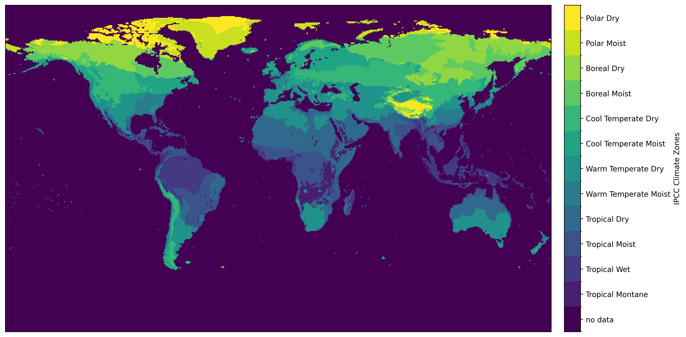

# IPCC Climate Zones

This repository contains raster and vector data files for the IPCC Climate Zones according to the 2019 definitions outlined in the [2019 Refinement to the 2006 IPCC Guidelines for National Greenhouse Gas Inventories](https://www.ipcc-nggip.iges.or.jp/public/2019rf/pdf/4_Volume4/19R_V4_Ch03_Land%20Representation.pdf) pages 3.47 and 3.48, updated with [these ammendments](https://www.ipcc-nggip.iges.or.jp/public/2019rf/corrigenda1.html), in addition to the code to create these files. The climate data is sourced from the Climatic Research Unit (University of East Anglia) and Met Office, where the [CRU TS Version 4.09](https://crudata.uea.ac.uk/cru/data/hrg/cru_ts_4.09/) dataset is used.

Raster data as a [GeoTIFF](https://github.com/colinahill/ipcc_climate_zones/blob/main/data/ipcc_climate_zones.tif) and [netCDF](https://github.com/colinahill/ipcc_climate_zones/blob/main/data/ipcc_climate_zones.nc), and vector data as a [geoJSON](https://github.com/colinahill/ipcc_climate_zones/blob/main/data/ipcc_climate_zones.geojson) data can be downloaded directly from the `data` directory. Otherwise, the following steps will recreate these files from the source climate data.

    

## Usage
1. Setup the environment
    - This package assumes [Astral UV](https://docs.astral.sh/uv/) is installed and `Python 3.11` is available.
    - Create the virtual environment and install dependencies with `uv venv`

2. Download the CRU climate data
    - Run `uv run download.py`
    - This will download approximately 6.4 GB of data to the `data` directory. The data is downloaded in 10-year chunks for the parameters: potential evapotranspiration (pet), mean temperature (tmp), precipitation (pre), and frost days (frs).

3. Create the climate zones
    - Run `uv run create_climate_zones.py`. This aggregates the climate data and applies the classification logic.
    - Output files for raster `ipcc_climate_zones.nc` and vector `ipcc_climate_zones.geojson` files are written to the `data` directory, as well as a PNG image `ipcc_climate_zones.png` visualizing the climate zones.

Optionally, the included elevation data `data/elevation_0.5deg` can be updated or replaced. This is only necessary if higher quality or resolution data is required.
The data was created by:
- Manually downloading 10km elevation from [Earth Env](https://www.earthenv.org/topography) to the `data` directory
- Running `uv run regrid_elevation.py` to regrid the elevation data to match the climate data
